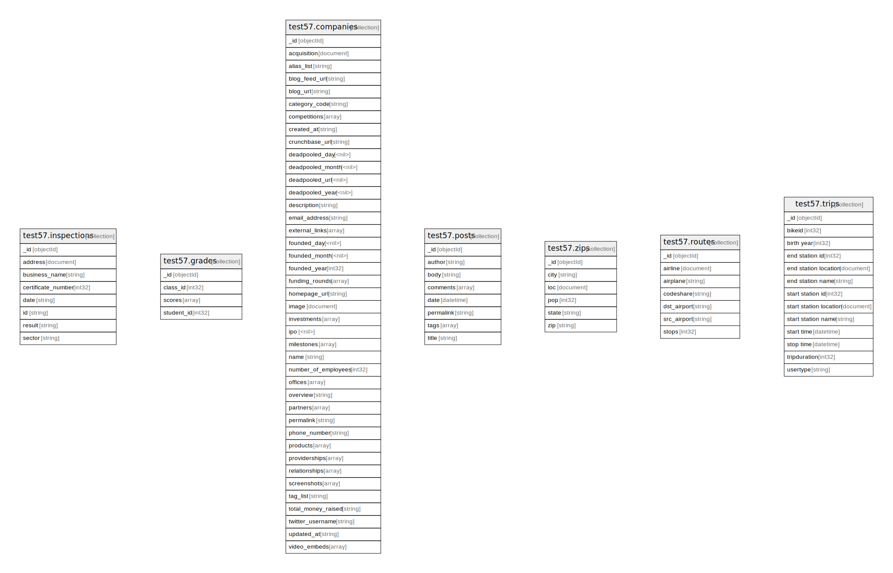

# 

## Tables

| Name | Attributes | Comment | Type |
| ---- | ------- | ------- | ---- |
| [test57.inspections](test57.inspections.md) | 8 | Count of documents is 80047 | collection |
| [test57.grades](test57.grades.md) | 4 | Count of documents is 100000 | collection |
| [test57.companies](test57.companies.md) | 41 | Count of documents is 9500 | collection |
| [test57.posts](test57.posts.md) | 8 | Count of documents is 500 | collection |
| [test57.zips](test57.zips.md) | 6 | Count of documents is 29470 | collection |
| [test57.routes](test57.routes.md) | 7 | Count of documents is 66985 | collection |
| [test57.trips](test57.trips.md) | 13 | Count of documents is 10000 | collection |

## Relations

---

> Generated by [tbls](https://github.com/k1LoW/tbls)
