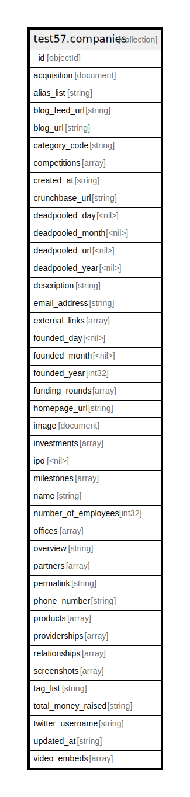

# test57.companies

## Description

Count of documents is 9500

## Attributes

| Name | Type | Default | Nullable | Occurrences | Percents | Children | Parents | Comment |
| ---- | ---- | ------- | -------- | ----------- | -------- | -------- | ------- | ------- |
| _id | objectId |  | false | 1000 | 100.0 |  |  |  |
| acquisition | document |  | false | 1000 | 100.0 |  |  |  |
| alias_list | string |  | false | 1000 | 100.0 |  |  |  |
| blog_feed_url | string |  | false | 1000 | 100.0 |  |  |  |
| blog_url | string |  | false | 1000 | 100.0 |  |  |  |
| category_code | string |  | false | 1000 | 100.0 |  |  |  |
| competitions | array |  | false | 1000 | 100.0 |  |  |  |
| created_at | string |  | false | 1000 | 100.0 |  |  |  |
| crunchbase_url | string |  | false | 1000 | 100.0 |  |  |  |
| deadpooled_day | <nil> |  | false | 1000 | 100.0 |  |  |  |
| deadpooled_month | <nil> |  | false | 1000 | 100.0 |  |  |  |
| deadpooled_url | <nil> |  | false | 1000 | 100.0 |  |  |  |
| deadpooled_year | <nil> |  | false | 1000 | 100.0 |  |  |  |
| description | string |  | false | 1000 | 100.0 |  |  |  |
| email_address | string |  | false | 1000 | 100.0 |  |  |  |
| external_links | array |  | false | 1000 | 100.0 |  |  |  |
| founded_day | <nil> |  | false | 1000 | 100.0 |  |  |  |
| founded_month | <nil> |  | false | 1000 | 100.0 |  |  |  |
| founded_year | int32 |  | false | 1000 | 100.0 |  |  |  |
| funding_rounds | array |  | false | 1000 | 100.0 |  |  |  |
| homepage_url | string |  | false | 1000 | 100.0 |  |  |  |
| image | document |  | false | 850 | 85.0 |  |  |  |
| investments | array |  | false | 1000 | 100.0 |  |  |  |
| ipo | <nil> |  | false | 1000 | 100.0 |  |  |  |
| milestones | array |  | false | 1000 | 100.0 |  |  |  |
| name | string |  | false | 1000 | 100.0 |  |  |  |
| number_of_employees | int32 |  | false | 1000 | 100.0 |  |  |  |
| offices | array |  | false | 1000 | 100.0 |  |  |  |
| overview | string |  | false | 1000 | 100.0 |  |  |  |
| partners | array |  | false | 1000 | 100.0 |  |  |  |
| permalink | string |  | false | 1000 | 100.0 |  |  |  |
| phone_number | string |  | false | 1000 | 100.0 |  |  |  |
| products | array |  | false | 1000 | 100.0 |  |  |  |
| providerships | array |  | false | 1000 | 100.0 |  |  |  |
| relationships | array |  | false | 1000 | 100.0 |  |  |  |
| screenshots | array |  | false | 1000 | 100.0 |  |  |  |
| tag_list | string |  | false | 1000 | 100.0 |  |  |  |
| total_money_raised | string |  | false | 1000 | 100.0 |  |  |  |
| twitter_username | string |  | false | 1000 | 100.0 |  |  |  |
| updated_at | string |  | false | 1000 | 100.0 |  |  |  |
| video_embeds | array |  | false | 1000 | 100.0 |  |  |  |

## Indexes

| Name | Definition | Comment |
| ---- | ---------- | ------- |
| _id_ | {"_id": {"$numberInt":"1"}} | Non-unique, Version 2 |

## Relations

---

> Generated by [tbls](https://github.com/k1LoW/tbls)
