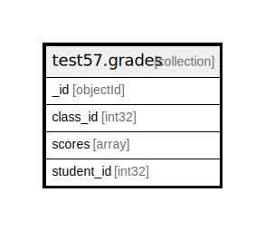

# test57.grades

## Description

Count of documents is 100000

## Attributes

| Name | Type | Default | Nullable | Occurrences | Percents | Children | Parents | Comment |
| ---- | ---- | ------- | -------- | ----------- | -------- | -------- | ------- | ------- |
| _id | objectId |  | false | 1000 | 100.0 |  |  |  |
| class_id | int32 |  | false | 1000 | 100.0 |  |  |  |
| scores | array |  | false | 1000 | 100.0 |  |  |  |
| student_id | int32 |  | false | 1000 | 100.0 |  |  |  |

## Indexes

| Name | Definition | Comment |
| ---- | ---------- | ------- |
| _id_ | {"_id": {"$numberInt":"1"}} | Non-unique, Version 2 |

## Relations

---

> Generated by [tbls](https://github.com/k1LoW/tbls)
