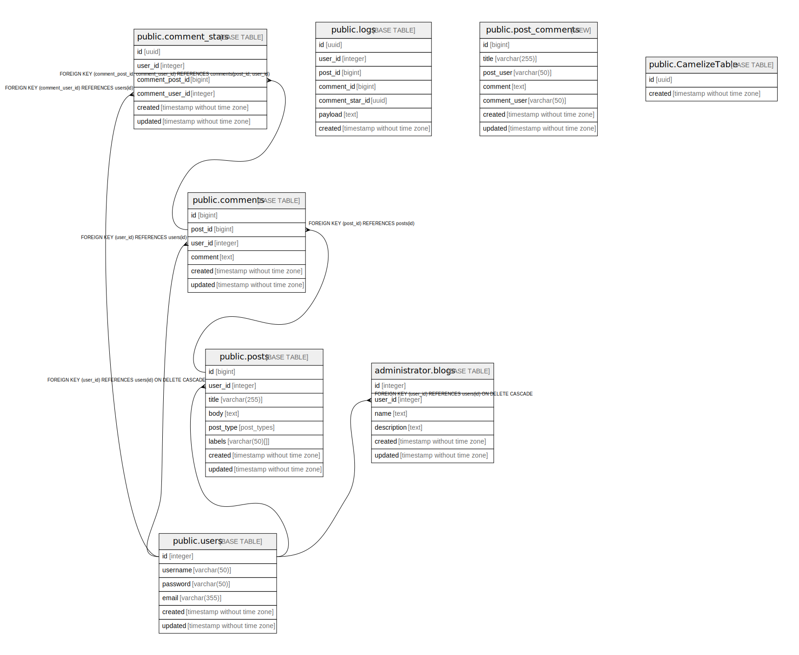

# test57

## Tables

| Name | Columns | Comment | Type |
| ---- | ------- | ------- | ---- |
| [public.users](public.users.md) | 6 | Users table | BASE TABLE |
| [public.posts](public.posts.md) | 8 | Posts table | BASE TABLE |
| [public.comments](public.comments.md) | 6 | Comments Multi-line table comment | BASE TABLE |
| [public.comment_stars](public.comment_stars.md) | 6 |  | BASE TABLE |
| [public.logs](public.logs.md) | 7 |  | BASE TABLE |
| [public.post_comments](public.post_comments.md) | 7 |  | VIEW |
| [public.CamelizeTable](public.CamelizeTable.md) | 2 |  | BASE TABLE |
| [administrator.blogs](administrator.blogs.md) | 6 |  | BASE TABLE |

## Stored procedures and functions

| Name | ReturnType | Arguments | Type |
| ---- | ------- | ------- | ---- |
| public.uuid_nil | uuid |  | FUNCTION |
| public.uuid_ns_dns | uuid |  | FUNCTION |
| public.uuid_ns_url | uuid |  | FUNCTION |
| public.uuid_ns_oid | uuid |  | FUNCTION |
| public.uuid_ns_x500 | uuid |  | FUNCTION |
| public.uuid_generate_v1 | uuid |  | FUNCTION |
| public.uuid_generate_v1mc | uuid |  | FUNCTION |
| public.uuid_generate_v3 | uuid | namespace uuid, name text | FUNCTION |
| public.uuid_generate_v4 | uuid |  | FUNCTION |
| public.uuid_generate_v5 | uuid | namespace uuid, name text | FUNCTION |
| public.update_updated | trigger |  | FUNCTION |

## Relations

---

> Generated by [tbls](https://github.com/k1LoW/tbls)
