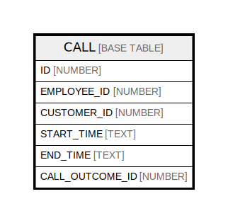

# CALL

## Description

<details>
<summary><strong>Table Definition</strong></summary>

```sql
create or replace TABLE CALL (
	ID NUMBER(38,0) NOT NULL autoincrement,
	EMPLOYEE_ID NUMBER(38,0) NOT NULL,
	CUSTOMER_ID NUMBER(38,0) NOT NULL,
	START_TIME VARCHAR(200) NOT NULL,
	END_TIME VARCHAR(200),
	CALL_OUTCOME_ID NUMBER(38,0),
	constraint CALL_AK_1 unique (EMPLOYEE_ID, START_TIME),
	constraint CALL_PK primary key (ID),
	constraint CALL_CALL_OUTCOME foreign key (CALL_OUTCOME_ID) references DEMO57.TEST57.CALL_OUTCOME(ID),
	constraint CALL_CUSTOMER foreign key (CUSTOMER_ID) references DEMO57.TEST57.CUSTOMER(ID),
	constraint CALL_EMPLOYEE foreign key (EMPLOYEE_ID) references DEMO57.TEST57.EMPLOYEE(ID)
);
```

</details>

## Columns

| Name | Type | Default | Nullable | Children | Parents | Comment |
| ---- | ---- | ------- | -------- | -------- | ------- | ------- |
| ID | NUMBER |  | false |  |  |  |
| EMPLOYEE_ID | NUMBER |  | false |  |  |  |
| CUSTOMER_ID | NUMBER |  | false |  |  |  |
| START_TIME | TEXT |  | false |  |  |  |
| END_TIME | TEXT |  | true |  |  |  |
| CALL_OUTCOME_ID | NUMBER |  | true |  |  |  |

## Relations



---

> Generated by [tbls](https://github.com/k1LoW/tbls)
