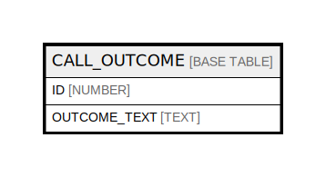

# CALL_OUTCOME

## Description

<details>
<summary><strong>Table Definition</strong></summary>

```sql
create or replace TABLE CALL_OUTCOME (
	ID NUMBER(38,0) NOT NULL autoincrement,
	OUTCOME_TEXT VARCHAR(128) NOT NULL,
	constraint CALL_OUTCOME_AK_1 unique (OUTCOME_TEXT),
	constraint CALL_OUTCOME_PK primary key (ID)
);
```

</details>

## Columns

| Name | Type | Default | Nullable | Children | Parents | Comment |
| ---- | ---- | ------- | -------- | -------- | ------- | ------- |
| ID | NUMBER |  | false |  |  |  |
| OUTCOME_TEXT | TEXT |  | false |  |  |  |

## Relations



---

> Generated by [tbls](https://github.com/k1LoW/tbls)
