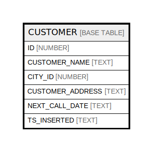

# CUSTOMER

## Description

<details>
<summary><strong>Table Definition</strong></summary>

```sql
create or replace TABLE CUSTOMER (
	ID NUMBER(38,0) NOT NULL autoincrement,
	CUSTOMER_NAME VARCHAR(255) NOT NULL,
	CITY_ID NUMBER(38,0) NOT NULL,
	CUSTOMER_ADDRESS VARCHAR(255) NOT NULL,
	NEXT_CALL_DATE VARCHAR(255),
	TS_INSERTED VARCHAR(255) NOT NULL,
	constraint CUSTOMER_PK primary key (ID),
	constraint CUSTOMER_CITY foreign key (CITY_ID) references DEMO57.TEST57.CITY(ID)
);
```

</details>

## Columns

| Name | Type | Default | Nullable | Children | Parents | Comment |
| ---- | ---- | ------- | -------- | -------- | ------- | ------- |
| ID | NUMBER |  | false |  |  |  |
| CUSTOMER_NAME | TEXT |  | false |  |  |  |
| CITY_ID | NUMBER |  | false |  |  |  |
| CUSTOMER_ADDRESS | TEXT |  | false |  |  |  |
| NEXT_CALL_DATE | TEXT |  | true |  |  |  |
| TS_INSERTED | TEXT |  | false |  |  |  |

## Relations



---

> Generated by [tbls](https://github.com/k1LoW/tbls)
