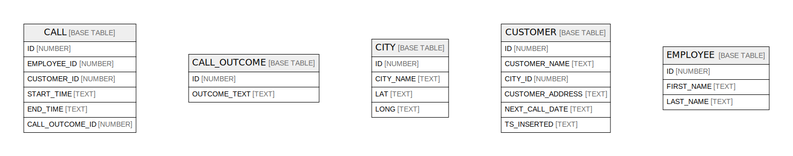

# TEST57

## Tables

| Name | Columns | Comment | Type |
| ---- | ------- | ------- | ---- |
| [CALL](CALL.md) | 6 |  | BASE TABLE |
| [CALL_OUTCOME](CALL_OUTCOME.md) | 2 |  | BASE TABLE |
| [CITY](CITY.md) | 4 |  | BASE TABLE |
| [CUSTOMER](CUSTOMER.md) | 6 |  | BASE TABLE |
| [EMPLOYEE](EMPLOYEE.md) | 3 |  | BASE TABLE |

## Relations

---

> Generated by [tbls](https://github.com/k1LoW/tbls)
